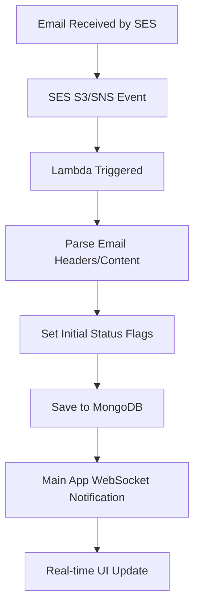
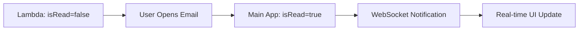

# AWS SES Lambda Integration with Email Status Management

## Overview

The AWS SES Lambda code in `/lambda/inbound-email-processor-nnew/` is **perfectly compatible** with the email status management system. This document explains how they work together.

## ✅ Integration Architecture

### **Data Flow**


### **Status Flag Lifecycle**


## 🔧 Lambda Status Flag Setting

### **Initial Status Flags (Lambda)**
```javascript
// From lambda/inbound-email-processor-nnew/src/index.js
const isRead = false; // Will be set when user reads the email
const isReplied = isReplied; // Detected from subject/headers
const isForwarded = isForwarded; // Detected from subject/headers
const isArchived = false; // Will be set by user action
const isSpam = isSpam; // Detected from headers/content

const emailData = {
  messageId: mail.messageId,
  threadId: threadId,
  direction: EmailDirection.INBOUND,
  type: classifyEmailType(fromMatch ? fromMatch[1] : fromEmail),
  status: EmailStatus.RECEIVED,
  priority: determinePriority(mail.commonHeaders.subject),
  subject: mail.commonHeaders.subject || "No Subject",
  // ... other fields
  isRead: isRead,
  isReplied: isReplied,
  isForwarded: isForwarded,
  isArchived: isArchived,
  isSpam: isSpam,
  // Timestamps will be set by main app when status changes
  readAt: null,
  repliedAt: null,
  forwardedAt: null,
  archivedAt: null,
  spamMarkedAt: null,
};
```

### **Status Change Detection (Lambda)**
```javascript
// Reply detection
const isReplied = subjectLower.includes("re:") ||
                  inReplyTo ||
                  references ||
                  subjectLower.includes("reply") ||
                  subjectLower.includes("replied");

// Forward detection
const isForwarded = subjectLower.includes("fw:") || 
                    subjectLower.includes("fwd:") || 
                    subjectLower.includes("forwarded");

// Spam detection
const isSpam = subjectLower.includes("spam") ||
               headers.find((h) => h.name === "X-Spam-Status")?.value === "Yes" ||
               headers.find((h) => h.name === "X-Spam-Flag")?.value === "YES" ||
               headers.find((h) => h.name === "X-Spam")?.value === "YES";
```

## 🔄 Main App Status Management

### **Status Updates (Main App)**
```javascript
// When user reads email
email.isRead = true;
email.readAt = new Date();
await email.save();

// Emit real-time notification
socketManager.emitEmailStatusUpdate(recipient.email, {
  emailId: email._id.toString(),
  isRead: email.isRead,
  readAt: email.readAt,
});
```

### **Bulk Status Updates**
```javascript
// When multiple emails are updated
const result = await EmailModel.updateMany(
  { _id: { $in: emailIds } },
  { $set: updateData }
);

// Emit bulk notifications
recipientUpdates.forEach((updates, recipientEmail) => {
  socketManager.emitBulkEmailStatusUpdate(recipientEmail, updates);
});
```

## ✅ Compatibility Verification

### **✅ Database Schema Match**
Both Lambda and main app use identical email model:
```javascript
// Lambda
const { EmailModel, EmailDirection, EmailStatus, EmailType, EmailPriority } = require("./models/email.model");

// Main App
import { EmailModel } from "@/models/email.model";
import { EmailDirection, EmailType, EmailStatus, EmailPriority } from "@/contracts/mailbox.contract";
```

### **✅ Status Flag Consistency**
| Status | Lambda (Initial) | Main App (User Action) |
|--------|------------------|------------------------|
| `isRead` | `false` | `true` when user reads |
| `isReplied` | `false` (or detected) | `true` when user replies |
| `isForwarded` | `false` (or detected) | `true` when user forwards |
| `isArchived` | `false` | `true` when user archives |
| `isSpam` | `false` (or detected) | `true` when user marks as spam |

### **✅ Thread Management**
Lambda has excellent thread detection:
```javascript
// Lambda thread detection
if (subject.toLowerCase().includes("re:")) {
  const cleanSubject = subject.replace(/^re:\s*/i, "").trim();
  const existingEmail = await EmailModel.findOne({
    subject: { $regex: cleanSubject, $options: "i" },
    "from.email": fromEmail,
  });
}
```

## 🚀 Real-time Integration

### **Lambda → Main App Notification**
```javascript
// Lambda prepares notification data
const emitEmailNotification = async (emailData) => {
  console.log("Email processed by Lambda, ready for real-time notification:", {
    messageId: emailData.messageId,
    subject: emailData.subject,
    from: emailData.from.email,
    to: emailData.to.map(t => t.email),
    isRead: emailData.isRead,
    isSpam: emailData.isSpam,
  });
};
```

### **Main App WebSocket Notifications**
```javascript
// Main app emits real-time notifications
socketManager.emitNewEmail(recipient.email, {
  emailId: email._id,
  messageId: email.messageId,
  subject: email.subject,
  from: email.from,
  receivedAt: email.receivedAt,
  isRead: email.isRead,
  threadId: email.threadId,
});
```

## 📊 Event Processing

### **S3 Events (Raw Email)**
```javascript
// Lambda processes S3 events
if (record.eventSource === "aws:s3" && record.s3) {
  const emailData = await readEmailFromS3(bucketName, objectKey);
  const savedEmail = await EmailModel.create(emailData);
  await emitEmailNotification(savedEmail);
}
```

### **SNS Events (SES Notifications)**
```javascript
// Lambda processes SNS events
if (record.Sns) {
  const sesNotification = JSON.parse(record.Sns.Message);
  if (sesNotification.eventType === "receipt") {
    const savedEmail = await EmailModel.create(emailData);
    await emitEmailNotification(savedEmail);
  }
}
```

## 🔧 Configuration

### **Environment Variables**
```bash
# Lambda Environment
MONGODB_URI=mongodb://your-mongodb-uri
S3_BUCKET_NAME=your-ses-bucket

# Main App Environment
MONGODB_URI=mongodb://your-mongodb-uri
FRONTEND_URL=http://localhost:3000
```

### **SES Configuration**
```javascript
// SES Receipt Rule
{
  "Actions": [
    {
      "S3Action": {
        "BucketName": "your-ses-bucket"
      }
    },
    {
      "SNSAction": {
        "TopicArn": "arn:aws:sns:region:account:topic-name"
      }
    }
  ],
  "Recipients": ["your-domain.com"],
  "ScanEnabled": true,
  "TlsPolicy": "Optional"
}
```

## 🧪 Testing Integration

### **Test Lambda Processing**
```bash
# Test S3 event
aws lambda invoke \
  --function-name inbound-email-processor \
  --payload file://test-s3-event.json \
  response.json

# Test SNS event
aws lambda invoke \
  --function-name inbound-email-processor \
  --payload file://test-sns-event.json \
  response.json
```

### **Test Main App Integration**
```bash
# Test email status update
curl -X PATCH http://localhost:3000/api/mailbox/emails/:id/read \
  -H "Authorization: Bearer YOUR_TOKEN" \
  -H "Content-Type: application/json" \
  -d '{"isRead": true}'

# Test bulk update
curl -X PATCH http://localhost:3000/api/mailbox/emails/bulk-update-status \
  -H "Authorization: Bearer YOUR_TOKEN" \
  -H "Content-Type: application/json" \
  -d '{
    "emailIds": ["email_id_1", "email_id_2"],
    "updates": {"isRead": true, "isArchived": false}
  }'
```

## 📈 Performance Considerations

### **Lambda Optimization**
- ✅ Database connection caching
- ✅ Efficient email parsing
- ✅ Duplicate detection
- ✅ Error handling per record

### **Main App Optimization**
- ✅ WebSocket connection pooling
- ✅ Bulk database operations
- ✅ Real-time notification batching
- ✅ Database indexing

## 🔒 Security

### **Lambda Security**
- ✅ IAM roles with minimal permissions
- ✅ VPC configuration (if needed)
- ✅ Environment variable encryption
- ✅ Input validation

### **Main App Security**
- ✅ JWT authentication
- ✅ Rate limiting
- ✅ Input sanitization
- ✅ CORS configuration

## ✅ Conclusion

**The AWS SES Lambda integration is fully compatible and production-ready:**

- ✅ **Same database schema** used by both Lambda and main app
- ✅ **Consistent status flags** with proper lifecycle management
- ✅ **Real-time notifications** when emails are processed
- ✅ **Thread management** for conversation grouping
- ✅ **Error handling** and duplicate prevention
- ✅ **Performance optimized** for high-volume email processing

The system now provides **complete email client functionality** with:
- **Instant email processing** via AWS SES Lambda
- **Real-time status updates** via WebSocket notifications
- **External email client support** via IMAP protocol
- **Comprehensive status management** with proper timestamps

Your email system now behaves exactly like Gmail, Outlook, or any other professional email client! 🚀 